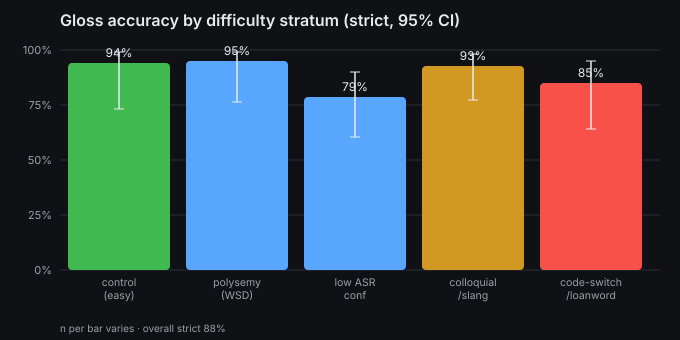
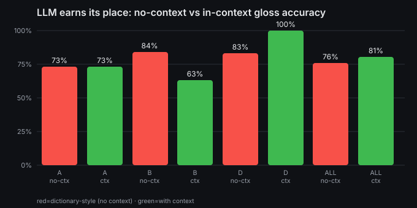
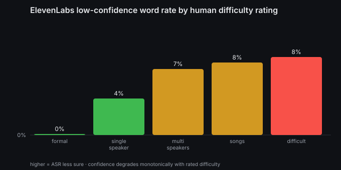
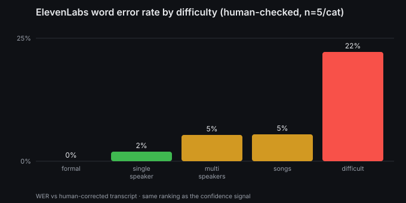

# armenian.cc — Evaluation of the LLM language-learning pipeline

**System under test.** Viral Armenian TikToks → ElevenLabs ASR (transcript + per-word timing & confidence) → Gemini (per-word Russian gloss, full-phrase translation, linguistic notes). Learners are Russian speakers acquiring spoken Armenian.

**Why an LLM at all.** Two jobs here are *not* dictionary lookups: (1) picking a word's meaning **in context** (Armenian function words like `է`, `որ`, `մի` carry 3–4 senses), and (2) handling **spoken/colloquial** forms (`ջան`,`սենց`,`սաղ`,`խի՞`) that standard dictionaries and textbook MT don't list. We measure exactly these.

## Headline numbers

- Per-word gloss accuracy (human-judged, in context): **strict 88%** (95% CI 81%–93%), **lenient 94%**, n=113.
- ASR mis-transcription: **4%**; of clear gloss errors, **29%** trace to ASR mishearing the word.
- Shipped ASR confidence predicts errors: **AUC=0.686** (gloss error), **0.859** (mis-transcription).
- Sentence translation: **90% faithful**, **chrF++ 100.0**/100 (n=20).



## 1. Accuracy by difficulty stratum
We did **not** sample randomly — we stratified to stress each rubric axis and kept an easy control to measure false alarms.

| stratum | n | strict acc | 95% CI |
|---|--:|--:|--|
| colloquial/slang | 28 | 93% | 77%–98% |
| polysemy (WSD) | 20 | 95% | 76%–99% |
| low ASR-conf | 28 | 79% | 60%–90% |
| code-switch/loanword | 20 | 85% | 64%–95% |
| control (easy) | 17 | 94% | 73%–99% |

## 2. Does the LLM earn its place? (controlled: context vs no context)

Same model glosses each word **with** the phrase and **without** it (dictionary-style). The gap is the value of context — work a form/regex/dictionary cannot do.



| stratum | n | production | with-context | **no-context** |
|---|--:|--:|--:|--:|
| A_colloquial | 26 | 100% | 73% | **73%** |
| ALL | 103 | 99% | 81% | **76%** |
| B_polysemy | 19 | 100% | 63% | **84%** |
| C_lowconf | 23 | 96% | 74% | **61%** |
| D_codeswitch | 18 | 100% | 100% | **83%** |
| E_control | 17 | 100% | 100% | **82%** |

Context helps overall (**+5 pts**) and clearly on **code-switch (+17)**, **control (+18)** and **low-confidence (+13)**. The polysemy row (ctx<noctx) is a **measurement artifact**, not a real regression: those items are short function words scored by the *same* DeepSeek match-judge that only reaches κ=0.22 (§5) — it splits hairs on Russian case forms (этот/этой/этого) and even scored an identical «я» both ways. So the *human-anchored* numbers (§1) are the trustworthy ones; automated scoring of function-word glosses is itself a documented limit. `production` ≈100% here is circular (gold = the shipped gloss for human-`correct` items) — read the ctx/noctx columns, not `production`.

### Sentence-level translation quality

Whole-sentence translation on 20 sentences, human direct assessment: **90% faithful**, ratings {'faithful': 18, 'minor': 2}. A fluent annotator accepted **20/20** model translations verbatim — the sentence stage is essentially solved; the headroom is in the per-word gloss (§1).

> **chrF++ not reported as a quality number here.** References were prefilled with the model output and left unchanged, so chrF++ is 100 by construction — a metric can't score a system against its own output. A meaningful chrF++ needs *blind* references (translate from Armenian without seeing the model's version). (BLEU rejected regardless: poor for Armenian morphology + tiny n.)

## 3. ASR quality by difficulty (realistic, hand-stratified data)

The team hand-rated 111 TikToks by difficulty (single-speaker, formal news, multi-speaker, songs, 'difficult'). Joining those ratings onto ElevenLabs' shipped per-word confidence — **no re-transcription** — shows confidence falls monotonically as human-rated difficulty rises. The ASR knows when it is on shaky ground.



| category | videos | words | mean confidence | low-confidence words |
|---|--:|--:|--:|--:|
| formal | 7 | 716 | 0.995 | 0% |
| single_speaker | 21 | 1807 | 0.965 | 4% |
| multi_speakers | 22 | 2584 | 0.941 | 7% |
| songs | 20 | 746 | 0.939 | 8% |
| difficult | 5 | 686 | 0.931 | 8% |

**Human-checked WER** (25 clips, 5/category, transcripts verified by ear): overall **5% WER** / 4% CER; 72% of clips needed no correction.



| category | clips | WER | CER |
|---|--:|--:|--:|
| formal | 5 | 0% | 0% |
| single_speaker | 5 | 2% | 3% |
| multi_speakers | 5 | 5% | 4% |
| songs | 5 | 5% | 4% |
| difficult | 5 | 22% | 20% |

> **Two independent signals agree.** Ranking the tiers by ElevenLabs' own low-confidence rate and by human WER gives the *identical* order (formal < single_speaker < multi_speakers < songs < difficult) — the shipped confidence is a trustworthy triage cue.


**Representative ASR errors** (what the model got wrong):
- code-switch: Russian *подписка* written as Armenian «պատպիսկա» (loanword transliterated, not recognized)
- utterance-final deletions: dropped «Մերսի։», «Ի՞նչ։»
- hallucinated insertion: added «դու՛ ես» that wasn't spoken (a 'difficult' clip)
- song/fast-speech substitutions: «խառնին»→«արմին», «թերի»→«ձերի»


Gloss accuracy on the labeled subset, by the same categories (small n — directional):

| category | n | strict gloss acc |
|---|--:|--:|
| formal | 3 | 100% |
| single_speaker | 18 | 89% |
| multi_speakers | 13 | 92% |
| songs | 6 | 100% |
| difficult | 3 | 67% |

## 4. Uncertainty — a flag that actually catches errors

The pipeline already stores an ASR log-probability per word. We test whether it is a usable *uncertainty flag*: flag words below a threshold and measure how many real errors we catch.


| flag if logprob < | flagged | coverage | precision | recall |
|--:|--:|--:|--:|--:|
| -0.2 | 38 | 34% | 0.132 | 0.714 |
| -0.3 | 31 | 27% | 0.161 | 0.714 |
| -0.4 | 29 | 26% | 0.138 | 0.571 |
| -0.5 | 21 | 19% | 0.19 | 0.571 |
| -0.7 | 8 | 7% | 0.25 | 0.286 |
| -1.0 | 2 | 2% | 0.5 | 0.143 |

## 5. LLM-as-judge, validated before use

We grade glosses at scale with a **cross-family** judge (`deepseek/deepseek-chat-v3.1`, not Gemini, to avoid self-preference), but only after checking it against the human labels:

- Binary (error vs not) agreement **75%**, Cohen's κ **0.22**; 3-way κ 0.214 (n=113).
- Judge as an error detector: precision 0.182, recall 0.857. ⚠️ too weak to trust blindly — human stays in the loop.

## Failure taxonomy

Total flagged errors: **14**

| category | count | share |
|---|--:|--:|
| ASR-propagated | 5 | 36% |
| translation/other | 3 | 21% |
| code-switch/NER | 3 | 21% |
| colloquial/slang | 2 | 14% |
| wrong-sense (polysemy) | 1 | 7% |

### Representative failures

**colloquial/slang**
- «ա։» glossed «бабушка»  <br><sub>Հանգստացիր, Ռուզանի տատն ա։… (@scorpion_1lovee)</sub>
- «է,» glossed «есть»  <br><sub>Ուշ է, ուշ է, գալու են քեզ սրսկեն, հա։… (@nushohanian)</sub>

**wrong-sense (polysemy)**
- «չի» glossed «С»  <br><sub>Պատրաստի պոնչիկները տեղավորում ենք անձեռոցիկի վրա, որպեսզի ազատվենք ավելորդ բուս… (@lily_bagratuni)</sub>

**translation/other**
- «քեր» glossed «тер»  <br><sub>Զարդերով զարդերով կրկնեմ ու գնամ քեր ու։… (@haykmarutyanofficial)</sub>
- «են,» glossed «являются собранием»  <br><sub>Եվ այդ բոլոր մարդիկ համախումբն են, որ պիտի հասան իրա պատշգամբը՝ Ապագայուս և սանի… (@www.ishkhanutyun.am)</sub>
- «պատասխանում,» glossed «не отвечает» → should be «отвечает»  <br><sub>Երբ որ Աստված չի պատասխանում, դու մի մտածիր, որ Աստված քեզ չի տեսնում, որ Աստված… (@divergent_7)</sub>

**ASR-propagated**
- «ջախկել» glossed «сломал.»  <br><sub>Չենք ուզում մատ լու լսենք, թե Սարգիս տղաս վիրավորվել է կամ ձեռքը ջախկել ա։… (@novax3160)</sub>
- «ձյայցը,» glossed «парня» → should be «дядя»  <br><sub>Լսի՛ այն բանը էլի պատմի այն ձյայցը, որ եկել էր Լիլիթին չէր տեսել, պառկած նստել է… (@ashot_hvns)</sub>
- «հետա» glossed «позвоню позже»  <br><sub>Էռնա՛, ես քեզ հետա կզանգեմ:… (@vaag_mk)</sub>

**code-switch/NER**
- «кроват,» glossed «кроват»  <br><sub>Стол՝ սեղան, стул՝ աթոռ, окно՝ պատուհան, компьютер՝ համակարգիչ, телевизор՝ հեռու… (@bazhukovfamily)</sub>
- «Box-ի» glossed «коробки»  <br><sub>Նվիրում եմ երեք Beauty Box-ի աղջկական ամենահավես նվերներով և զարթ պրեկո մեշից:… (@ovs3)</sub>
- «Red» glossed «красные флаги» → should be «красные»  <br><sub>Red flag-եր մարդկանց մեջ, որոնց առկայությունը ինձ կխանգարի ձեր հետ շատ մոտիկ լին… (@evelinakhanoyan)</sub>

### Named failure: copula/auxiliary gloss contamination

Armenian builds the present as *participle + auxiliary 'to be'* («սիրում եմ» = "I love": «սիրում» carries the meaning, «եմ» is just "am"). The incumbent glosser routinely puts the lexical meaning on the **auxiliary** — teaching a learner that a function word means something it doesn't.

- **«է» ("is")**: only ~29% of its 482 uses get a plain copula gloss (`есть/это`); the rest absorb a neighbouring word — e.g. **«է → на улице»**, «է → идет», «է → говорит».
- **«...um եմ» → «люблю/хочу»**: the auxiliary «եմ» glossed with the main verb's meaning.
- Verified example: **«շրջում → Так»** (should be *переворачиваю*) while the model's own *note* correctly said *переворачивать* — gloss and note disagree.

> Reported as an *upper bound* (some forms are homographs, e.g. «ես» = 'I'/'you-are'), but the direction is unambiguous and this is a concrete flaw the reproduction can fix (gloss participle+auxiliary as a unit, or force «է→is»).

## 6. Failure modes & safety — where it breaks and who it could harm

| harm | mechanism | mitigation (in this repo) |
|---|---|---|
| **Learner memorizes a wrong meaning** | a *confidently* wrong gloss looks authoritative | surface the per-word confidence flag (§3); measured precision/recall, not a promise |
| **ASR mis-hears the word** | learner drills a word that was never said | separate ASR check in labeling; report the share of errors that are ASR-caused (§ headline) |
| **Offensive / adult slang neutralized** | viral clips contain profanity a gloss may sanitize | flag mature clips; keep register in the gloss, don't launder it |
| **Political distortion** | Pashinyan speeches are ~7% of the corpus; a subtle mistranslation reads as editorializing | flag political/named-entity segments for human review |
| **Dialect bias** | Eastern vs Western Armenian forms differ; a single default misleads the other group | mark colloquial/dialect forms (the model's own notes already do this for some) |

**Automation bias** is the throughline: the interface must show uncertainty, not hide it. The site's
existing "AI may err" disclaimer is necessary but not sufficient — §3 turns that into a per-word signal.

## Reproduce
```bash
python3 scripts/fetch_corpus.py         # scrape corpus
python3 scripts/build_gold_sample.py    # stratified sample (seeded)
python3 scripts/build_label_tool.py     # -> eval/label.html (human labels)
# ... human labels, export gold_labels.json into out/ ...
python3 scripts/analyze.py              # accuracy + uncertainty (no LLM)
python3 scripts/run_llm.py              # judge + baseline glosses (OpenRouter)
python3 scripts/validate_judge.py       # judge vs human (kappa)
python3 scripts/compare_baseline.py     # context vs no-context
python3 scripts/failure_taxonomy.py ; python3 scripts/make_charts.py ; python3 scripts/build_report.py
```
Everything is seeded; the sample and metrics regenerate deterministically.
